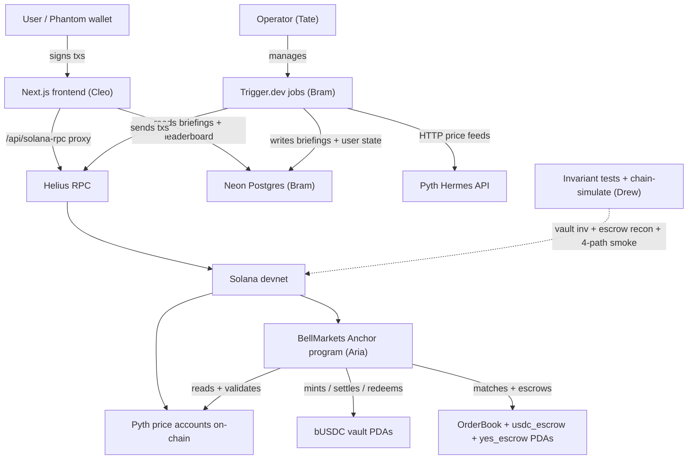

# Architecture

## Summary

BellMarkets is a non-custodial Solana dApp implementing the Gauntlet "Meridian" PRD: a binary outcome market where users trade YES/NO tokens against bUSDC for *"Will [STOCK] close above [PRICE] today?"* on the MAG7 universe. Settlement is an on-chain Pyth price read shortly after 4:00 PM ET; the order book is **in-program** — a bounded price-time-priority CLOB inside the Anchor program (DR-020, supersedes DR-001 after Phoenix devnet bootstrap proved impractical inside the build window). The daily lifecycle is orchestrated by an off-chain **Trigger.dev** service, but `settle_market` is permissionless (DR-002) so the system survives orchestration failure. Frontend is **Next.js 14.2.18 + React 18 + TypeScript** with `@solana/wallet-adapter-react`; real-time book + portfolio updates use `connection.onAccountChange` (Helius WebSocket via server-side proxy) — no polling.

The team is four named leads coordinated by a persistent Director (`/tate`), working in Mode 2 per-lead worktrees over a ~4-day window to a hard final Mon 2026-05-25 7pm ET. Aria owns the Anchor program (Anchor 0.31.1 on Solana 3.1.14, deployed at `599h7VznYR4CxyrG5nQbhR13qtRuwPcbnNr5QqbkS7uV`, deploy_index=9); Bram owns the Trigger.dev automation service + AI briefings + Neon DB; Cleo owns the Next.js frontend + wallet flow + Vercel deploy; Drew owns cross-cutting integration tests + the order-book invariant suite + pre-mainnet readiness. Per Hard YES #5, the demo includes the cron-failure path: triggering `settle_market` from a test user wallet — load-bearing evidence that DR-002 is real.

Three architectural commitments dominate the design: (1) **build the matcher in-program** (DR-020, adopting Keith Mazanec's parallel-cohort adversarially-reviewed reference design — shorter audit surface, no Phoenix devnet bootstrap dependency, escrow telescoping without dust); (2) **on-chain owns the rules, off-chain owns the schedule, `settle_market` is permissionless** (DR-002 — automation can fail and the system still works); (3) **UX abstracts Buy NO / Sell NO into single signed transactions** (POV-3 — Buy NO bundles `mint_pair + place_order(SELL_YES, IOC)` atomically; Sell NO is the inverse). Implementation patterns from a same-project veteran's lessons (LESSONS.md): **vendor a 30-line Pyth price parser** instead of `pyth-sdk-solana` (avoids Borsh dep cascade); **bounded zero-copy `OrderBook` PDA** (128 orders/side, 16,448 B) initialized in two phases (`init_order_book` + `grow_order_book`) to fit Solana's `MAX_PERMITTED_DATA_INCREASE` realloc cap; **three-phase matching** (plan / settle / apply) for clean failure boundaries. Verification is anchored by Rust property tests (100/100 in `programs/bell-markets/src/instructions/*.rs`) + Drew's `tests/contracts/test_order_book_invariants.ts` (vault invariant, escrow reconciliation, four-path smoke) + Drew's `tests/integration/live-program-call.test.ts` (chain-simulate). E2E trade verified on devnet on submission day (2026-05-25).

Devnet is the submission target; mainnet-beta is a documented post-demo stretch with `force_cancel_order` + `close_order_book` as v1.1 hard preconditions (see `specs/deferred.md`). **Solana is canonical for funds; a Neon Postgres serves product surface** — users, OAuth, AI briefings, notification prefs (DR-003 amended). The DB can be wiped without affecting redemption rights. Repo is dual-pushed to GitLab (cohort visibility) and GitHub (portfolio). Apache 2.0 licensed.

## Decision Record

| Decision | Choice | Defense | Tradeoff |
|---|---|---|---|
| **CLOB integration** | **In-program** bounded CLOB (DR-020, supersedes DR-001) — adopted Keith Mazanec's parallel-cohort reference design with adversarial review pre-applied | I pivoted from Phoenix to in-program after Phoenix devnet bootstrap proved impractical inside the build window (Phoenix's market-init requires our YES mint to exist before our program creates it). Adopting a vetted peer-reference design with adversarial review baked in is the senior-engineer move: shorter audit surface, fewer novel bugs, escrow telescoping built-in | Novel audit surface — must pass a formal third-party audit before mainnet. Phoenix integration code stays dormant in the program (additive, not removed) so Phoenix-as-secondary-venue remains a v2 candidate |
| **Settlement authority** | `settle_market` permissionless on-chain; off-chain automation is convenience only | I chose permissionless settle so the system survives our automation crashing; the demo proves this by triggering settle from a non-cron wallet; cheaper mainnet ops (~5-10×); engineering symmetry with the in-program matcher's permissionless-crank philosophy | ~half a day of extra on-chain timing-logic work; benign race-condition wasted fees when two callers race |
| **Oracle** | Pyth Network, accessed via vendored 30-line parser (not `pyth-sdk-solana`) | I chose Pyth for native MAG7 equity coverage + native staleness/confidence semantics; vendored parser avoids Borsh-version cascade documented by a prior-team veteran (LESSONS.md Lesson 1) | We own 30 lines of Pyth byte-offset parsing; if Pyth changes layout we update those lines |
| **Order book account pattern** | Bounded zero-copy `OrderBook` PDA (`ORDERBOOK_N = 128` per side, 16,448 B), two-phase init (`init_order_book` + `grow_order_book`) to fit Solana's `MAX_PERMITTED_DATA_INCREASE` cap | I chose bounded over slab-style because the bounded layout has predictable rent (~0.1154 SOL/PDA), reads decode cleanly via Anchor IDL, and matches Keith's reference design exactly. Two-phase init is forced by Solana's per-realloc cap (10 KB) — the OrderBook is 16 KB | Hard cap at 128 resting orders per side per market (acceptable for the demo + early mainnet; not a deep-liquidity venue). OrderBook rent is the biggest single per-market cost — v1.1 `close_order_book` recovers it post-settle (per `specs/deferred.md`) |
| **Anchor account discipline** | `Box<Account<'info, T>>` on every heavy account | I chose Box-by-default because the BPF stack is 4KB per frame and Anchor's `try_accounts` deserializes onto the stack; unboxed heavy accounts silently overflow | Slight CU cost of heap allocation; trivial compared to a deploying-but-not-executing program |
| **Toolchain triple** | Solana CLI 3.1.14 / Anchor 0.31.1 / Rust 1.95 / `@coral-xyz/anchor` JS 0.30.1 | I chose this combination because a prior-team veteran burned 3 hours validating it against Solana 3.x sBPF v3 VM (LESSONS.md Lesson 1); cheaper to inherit a known-working combo than rediscover | We're pinned to specific versions; bumping requires re-validation |
| **Frontend stack** | Next.js 14.2.18 + React 18 + TS strict + `@solana/wallet-adapter-react` + TanStack Query + Zustand + Tailwind + shadcn/ui | I chose Next 14.2.18 specifically because LESSONS.md cites it as "stable with `@solana/wallet-adapter`" — proven by a same-project veteran. React 19 + Next 15 may work but risks a wallet-adapter bug at hour 50 of 72 | Not on the bleeding edge of Next.js features; none of which we use |
| **Realtime updates** | Helius `connection.onAccountChange` WebSocket subscriptions; no polling | I chose subscriptions for the demo robustness story ("scales linearly with users; no RPC rate-limit pressure") and natural Phoenix-crank alignment | Slightly more complex reconnect-on-disconnect handling than polling; TanStack Query bridges the WebSocket → component-state gap |
| **Automation deploy** | Trigger.dev (free tier) at separate `services/automation/` package | I chose Trigger.dev because I've used it on a prior Solana project (w3Swap); separate package keeps Cleo + Bram's workstreams clean | Vendor dependency on Trigger.dev uptime; mitigated by DR-002 (any user can crank if automation dies) |
| **Verification** | Compressed-time lifecycle simulation (60s = 1 trading day, 3 wallets, multi-user) + parameterized mocha edge cases | I chose simulation as primary verification because LESSONS.md Lesson 10 shows it catches multi-user contention bugs that per-function tests miss; mocha covers specific edge cases (at-strike, double-redeem, stale Pyth) | More complex test infrastructure than just unit tests; pays off when demo audience triggers real concurrency |
| **Database role** | Solana canonical for funds; Neon Postgres for product surface (DR-003 amended) | I chose chain-as-truth-for-money so a DB wipe never affects redemption rights; the DB serves users, OAuth, AI briefings, notification prefs, leaderboard reads — features that don't belong on-chain | DB drift is possible (chain is the reconciliation source); DB outage degrades UX (briefings, leaderboard) but does not affect trading or redemption |
| **Devnet primary; mainnet stretch** | Solana devnet only for submission | PRD requires devnet; mainnet introduces custody + funding + monitoring burden outside the 3-day window | No "production-ready evidence" in the submission; reviewers see devnet only |
| **Repo posture** | Public on GitHub after demo | Portfolio piece; the architecture work itself is showcase-grade | More audience pressure on prose quality; reviewable by hiring partners |

## System Shape

1. **Onchain — BellMarkets Anchor program** (Aria): the authoritative state. Holds bUSDC vault + USDC/YES escrows per market, mints YES/NO SPL tokens, enforces the $1 invariant, validates Pyth for settlement, runs the in-program matcher (place/cancel/match) with three-phase execution, writes outcomes immutably, pays out on redeem. Permissionless `settle_market` + `match_orders` + `close_settled_market`; admin-only `create_strike_market` / `pause` / `admin_settle` (with on-chain time delay) / fee config updates. 28 instructions, 7 account types, 57 error variants at deploy_index=9. Full lifecycle (create → mint → trade → settle → redeem) verified on-chain on submission day.
2. **Automation Service — Trigger.dev jobs** (Bram): off-chain orchestration with no special authority. Scheduled jobs: morning create-markets (~8am ET), post-close grid evolution (4:05pm ET — settle + anchor next day's grid), half-day variant (1:05pm ET), after-hours + pre-market wild-swing checks. AI briefings (Anthropic Sonnet) + Neon DB CRUD for product surface. If Trigger.dev fails, the operator runs the same job via CLI manually OR any user cranks settle.
3. **Frontend — Next.js trading app** (Cleo): four trade buttons (Buy/Sell × YES/NO), each bundling its required instructions into one signed transaction. Real-time book + portfolio via WebSocket subscriptions (`connection.onAccountChange`). Position-aware constraint enforcement at the UX layer. Helius RPC accessed via server-side proxy (`/api/solana-rpc`) — key never appears in client bundle. Wallet adapter (Phantom / Backpack / Solflare). Vercel deploy.
4. **Quality + Demo Harness** (Drew): pre-mainnet-readiness narrative, order-book invariant test suite (`tests/contracts/test_order_book_invariants.ts` — vault invariant + escrow reconciliation + four-path smoke), live-program-call chain-simulate tests, demo runbook + receipts capture.

Compact flow:

## Data And Tool Scope

**In scope:**
- 7 MAG7 stocks: AAPL, MSFT, GOOGL, AMZN, NVDA, META, TSLA
- ~5 unique strikes per stock after ±3/6/9% dedup (~35 markets/day)
- Full daily lifecycle: create → mint → trade → settle → redeem
- All 4 trade actions atomic (Buy/Sell × Yes/No)
- Permissionless `settle_market`; admin-only `create_strike_market`, `pause`, `admin_settle`
- Solana devnet deploy with a one-command demo path
- Cron-failure recovery via permissionless settle from any user wallet

**Out of scope:**
- Mainnet, real funds (PRD hard rule)
- KYC, custody, off-ramp
- Non-MAG7 stocks, margin, perpetuals, cross-strike netting
- Mobile, i18n, offline mode
- Fallback oracle if Pyth fails (admin override on 1hr time delay is the recovery)
- Phoenix CLOB integration (deferred to v2 per DR-020; original DR-001 pivoted on 2026-05-24)
- Limit-side NO trades (DR-019 — NO market-only in v1)
- OrderBook + escrow rent recovery post-settle (deferred to v1.1, P1 pre-mainnet)
- Mint-close (post-redemption supply==0 cleanup; deferred to v1.2)
- Self-funding settle bounty (deferred)
- Multi-tenant admin dashboard (deferred)
- Historical-data charts / analytics (deferred)

## User/UI/API Contract

A user lands on `/` (landing) or `/markets` (grid of 7 stocks with live counts). They connect a wallet (Phantom/Backpack/Solflare via `@solana/wallet-adapter-react` — frontend never sees private keys). Selecting a stock-strike opens `/trade/[ticker]/[strike]`: real-time order book in both Yes and No perspectives, a four-button trade panel (Buy Yes / Buy No / Sell Yes / Sell No) with position-aware constraints (the frontend guides users to close opposite positions first before buying).

Each trade button → one wallet-signed transaction. The wallet's transaction simulation surfaces the on-chain calls; for composite operations (Buy NO bundles `mint_pair + place_order(SELL_YES, IOC)`; Sell NO bundles `place_order(BUY_YES, IOC) + redeem_pair`) the user sees more invocations but the action remains a single signature. The PRD's atomicity contract (POV-3) is preserved by bundling, not by hiding state changes from the wallet. **DR-019 amendment:** Limit-side NO trades are disabled in v1 (NO is market-only) because a resting Limit NO would strand fees on cancel. Limit YES + the four atomic flows remain.

`/portfolio` shows active positions, settled outcomes, P&L per market, redeem button per winning side. After settlement (≥ `settlement_window` and Pyth validates), any user — even one without a position — can crank `settle_market` from a "Trigger settle" affordance; this is the cron-failure recovery path (Hard YES #5). After settle, redeem buttons activate; redemption is per-token, one signature each.

The system has no admin-facing UI for non-emergency operations; pause/unpause and `admin_settle` are CLI-driven by the operator (Tate).

## Verification And Safety

- **Most important verification rule:** the $1 USDC invariant — `yes_payout + no_payout == $1.00` and `vault_balance == $1 × open_pairs`. Verified by the compressed-time simulation across multi-user activity; supplemented by parameterized mocha edge cases.
- **Most important refusal/safety rule:** `settle_market` rejects all reads where Pyth status ≠ Trading, slot is older than the staleness threshold, OR the confidence interval exceeds the configurable bps threshold. Outcome is immutable once written.
- **Most important logging/audit rule:** no raw oracle / RPC / wallet logs (>20 lines) in handoffs, session recaps, commits, or test artifacts. No live stock prices in tests (mocked Pyth feeds). All event logs scrub keys before persistence.
- **Eval focus:** the compressed-time lifecycle simulation runs in CI on every commit; it must cover create → mint → ≥3 trade paths → settle → redeem with at least 3 distinct test wallets and assert all 5 invariants from logged events. Adversarial paths (re-settle, settle-before-window, double-redeem, stale Pyth) must revert with specific error codes.

## Deployment And Operations

- **MVP deployment shape:** Anchor program → Solana devnet via `anchor deploy`. Frontend → Vercel preview deploy. Automation → Trigger.dev (free tier). All linked from a one-command demo path (`scripts/one-command-demo.sh`).
- **Secrets/auth handling:** all wallet keys in gitignored `keys/devnet-*.json`. RPC keys + Trigger.dev tokens in `.env` (not committed; `.env.example` shows shape). Frontend uses `@solana/wallet-adapter-react` — never holds key material.
- **Observability:** Trigger.dev dashboard for cron job runs; Solana Explorer for on-chain state; Helius dashboard for RPC + WebSocket usage. No custom dashboard for the MVP.
- **Production caveats (mainnet stretch only):** mainnet-beta requires a funded automation wallet, production Pyth feed IDs, key rotation discipline, and monitoring/alerting. All deferred per `specs/deferred.md`. The architecture is designed so this expansion doesn't require redesign — just additional operational surface.

## Open Questions

- **Pyth MAG7 devnet feed coverage.** Pyth maintains MAG7 equity feeds, but devnet coverage during market hours is inconsistent per ticker. For demo, settlement falls back to admin-override with a time-delayed gate where a feed is unavailable; on mainnet, the same code path uses live feeds with no admin fallback. Drew documents per-ticker status in `docs/pyth-feed-status.md` (post-submission).
- **OrderBook depth ceiling.** `ORDERBOOK_N = 128` per side per market. Adequate for demo + early mainnet; not a deep-liquidity venue. Capacity expansion (256 or slab-style) is a v2 schema change that requires migration planning.
- **Rent recovery at scale.** ~0.122 SOL/market currently stranded post-settle (verified on-chain 2026-05-25). v1.1 `force_cancel_order` + `close_order_book` recovers 95.2%. P1 pre-mainnet precondition — see `specs/deferred.md` + `docs/cost-analysis.md`.
- **Composite-tx user education (Buy NO / Sell NO).** We considered + rejected adding a separate confirmation modal on the trade panel for three reasons: (1) the wallet's tx-simulation already shows state changes, so a modal duplicates the surface without adding information; (2) the actual gap is *interpretation* of those state changes (why is a Buy-NO flow minting YES?), which is a documentation/FAQ problem rather than a UI-surface problem; (3) **trading is latency-sensitive — a modal adds friction that defeats the four-button speed contract** (POV-3). Instead, user education for composite-tx flows lives in `docs/USER-GUIDE.md`. Defense to a hostile reviewer: "We chose docs over a modal because the modal duplicates information without adding any, costs time on every trade, and the speed-of-execution UX is load-bearing for an order-book product."

## Next Implementation Step

**Post-submission v1.1 (pre-mainnet preconditions):** ship `force_cancel_order` + `close_order_book` instructions (estimated 60-90 min Aria, including invariant tests + a new deploy_index). Recovers ~95% of stranded per-market SOL rent. Pre-mainnet checklist (per `docs/architecture/pre-mainnet-readiness.md` §7) also includes: real Pyth MAG7 feed audit, formal third-party audit of the in-program matcher (highest-risk new surface), and mainnet keypair architecture (DR-016 v2 plan).

**Post-submission v1.2 (polish):** `close_market_mints` instruction (recovers the remaining 4.8% stranded rent — requires adding `mint::close_authority` to `create_strike_market`'s Anchor schema; defer until next program upgrade for an unrelated reason).
