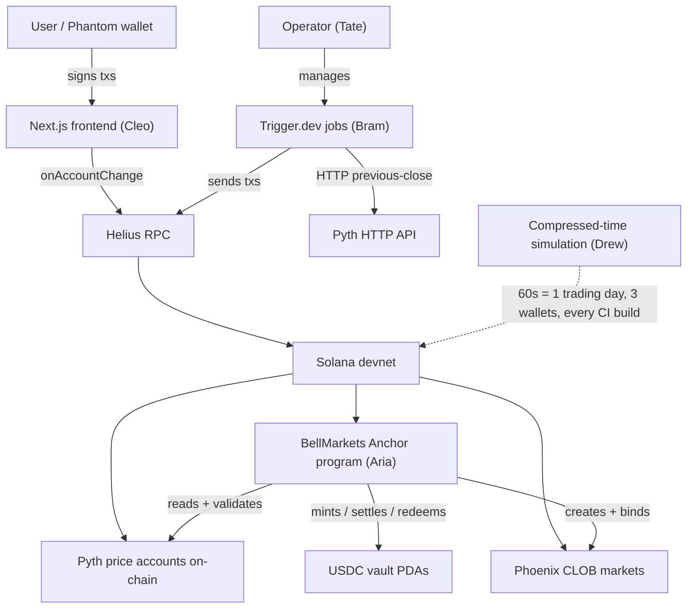

# Architecture

## Summary

BellMarkets is a non-custodial Solana dApp implementing the Gauntlet "Meridian" PRD: a binary outcome market where users trade Yes/No tokens against USDC for *"Will [STOCK] close above [PRICE] today?"* on the MAG7 universe. Settlement is an on-chain Pyth price read at 4:05 PM ET; the order book is **Phoenix** (DR-001); the daily lifecycle is orchestrated by an off-chain **Trigger.dev** service, but `settle_market` is permissionless (DR-002) so the system survives orchestration failure. Frontend is **Next.js 14.2.18 + React 18 + TypeScript** with `@solana/wallet-adapter-react`; real-time book + portfolio updates use `connection.onAccountChange` (Helius WebSocket) — no polling.

The team is four named leads coordinated by a persistent Director (`/tate`), working in Mode 2 per-lead worktrees over a ~3-day window to a hard final Mon 2026-05-25 7pm ET. Aria owns the Anchor program (Anchor 0.31.1 on Solana 3.1.14); Bram owns the Trigger.dev automation service; Cleo owns the Next.js frontend; Drew owns cross-cutting integration tests + the **compressed-time lifecycle simulation** that validates the $1 USDC invariant across multi-user activity. Per Hard YES #5, the demo includes the cron-failure path: killing automation mid-settle and triggering `settle_market` from a test user wallet — load-bearing evidence that DR-002 is real, not theoretical.

Three architectural commitments dominate the design: (1) **integrate Phoenix; don't build a matcher** (DR-001 — saves ~1.5 days of build budget, accepts hard dependency); (2) **on-chain owns the rules, off-chain owns the schedule, `settle_market` is permissionless** (DR-002 — automation can fail and the system still works); (3) **UX abstracts Buy No / Sell No into single signed transactions** (POV-3 — the four-button mental model is preserved by bundling `mint_pair + Phoenix order` atomically). Two implementation patterns from a Day-21 same-project veteran's lessons (LESSONS.md): **vendor a 30-line Pyth price parser** instead of `pyth-sdk-solana` (avoids Borsh dep cascade), and **use `UncheckedAccount` + manual byte layout** for Phoenix order book accounts (the only pattern that works for > 1 KB Solana accounts; what Phoenix, Serum, and OpenBook themselves use). Verification is anchored by the compressed-time simulation (60s = 1 trading day, 3 wallets, real on-chain finality) running on every CI build; supplemented by parameterized mocha tests for specific edge cases (at-strike, double-redeem, stale Pyth, settle-before-window).

Devnet is the submission target; mainnet-beta is a documented post-demo stretch. No off-chain database — Solana RPC is the source of truth. Repo is dual-pushed to GitLab (cohort visibility) and GitHub (portfolio); going public on GitHub post-demo. Apache 2.0 licensed.

## Decision Record

| Decision | Choice | Defense | Tradeoff |
|---|---|---|---|
| **CLOB integration** | Phoenix (existing audited CLOB) | I chose Phoenix over building a custom matcher to save ~1.5 days of build budget on a 3-day window; matching logic is audited; permissionless-crank model aligns with our settle design | Hard dependency on Phoenix; weaker "we built our own engine" narrative; no fallback CLOB if Phoenix has an outage |
| **Settlement authority** | `settle_market` permissionless on-chain; off-chain automation is convenience only | I chose permissionless settle so the system survives our automation crashing; demo proves this by killing the cron mid-settle and having a user crank it themselves; cheaper mainnet ops (~5-10×); aligns with Phoenix's crank philosophy | ~half a day of extra on-chain timing-logic work; benign race-condition wasted fees when two callers race |
| **Oracle** | Pyth Network, accessed via vendored 30-line parser (not `pyth-sdk-solana`) | I chose Pyth for native MAG7 equity coverage + native staleness/confidence semantics; vendored parser avoids Borsh-version cascade documented by a prior-team veteran (LESSONS.md Lesson 1) | We own 30 lines of Pyth byte-offset parsing; if Pyth changes layout we update those lines |
| **Order book account pattern** | `UncheckedAccount<'info>` + manual byte layout with 8-byte magic prefix | I chose this because it's the only pattern that works for > 1 KB Solana accounts (Anchor's `Account<T>` and `zero_copy(unsafe)` both fail at runtime); same pattern Phoenix, Serum, OpenBook all use | Manual byte access is more error-prone than Anchor's helpers; mitigated by magic prefix validation + Drew's compressed-time simulation catching field-offset bugs |
| **Anchor account discipline** | `Box<Account<'info, T>>` on every heavy account | I chose Box-by-default because the BPF stack is 4KB per frame and Anchor's `try_accounts` deserializes onto the stack; unboxed heavy accounts silently overflow | Slight CU cost of heap allocation; trivial compared to a deploying-but-not-executing program |
| **Toolchain triple** | Solana CLI 3.1.14 / Anchor 0.31.1 / Rust 1.95 / `@coral-xyz/anchor` JS 0.30.1 | I chose this combination because a prior-team veteran burned 3 hours validating it against Solana 3.x sBPF v3 VM (LESSONS.md Lesson 1); cheaper to inherit a known-working combo than rediscover | We're pinned to specific versions; bumping requires re-validation |
| **Frontend stack** | Next.js 14.2.18 + React 18 + TS strict + `@solana/wallet-adapter-react` + TanStack Query + Zustand + Tailwind + shadcn/ui | I chose Next 14.2.18 specifically because LESSONS.md cites it as "stable with `@solana/wallet-adapter`" — proven by a same-project veteran. React 19 + Next 15 may work but risks a wallet-adapter bug at hour 50 of 72 | Not on the bleeding edge of Next.js features; none of which we use |
| **Realtime updates** | Helius `connection.onAccountChange` WebSocket subscriptions; no polling | I chose subscriptions for the demo robustness story ("scales linearly with users; no RPC rate-limit pressure") and natural Phoenix-crank alignment | Slightly more complex reconnect-on-disconnect handling than polling; TanStack Query bridges the WebSocket → component-state gap |
| **Automation deploy** | Trigger.dev (free tier) at separate `services/automation/` package | I chose Trigger.dev because I've used it on a prior Solana project (w3Swap); separate package keeps Cleo + Bram's workstreams clean | Vendor dependency on Trigger.dev uptime; mitigated by DR-002 (any user can crank if automation dies) |
| **Verification** | Compressed-time lifecycle simulation (60s = 1 trading day, 3 wallets, multi-user) + parameterized mocha edge cases | I chose simulation as primary verification because LESSONS.md Lesson 10 shows it catches multi-user contention bugs that per-function tests miss; mocha covers specific edge cases (at-strike, double-redeem, stale Pyth) | More complex test infrastructure than just unit tests; pays off when demo audience triggers real concurrency |
| **No off-chain DB** | Solana RPC + TanStack Query in-memory cache is enough | I chose RPC-as-truth because adding a DB creates a sync surface that drifts; non-custodial story is stronger without one; 3-day budget doesn't include cache-invalidation correctness | No historical query surface beyond Solana tx history; chart/aggregate features deferred (`specs/deferred.md`) |
| **Devnet primary; mainnet stretch** | Solana devnet only for submission | PRD requires devnet; mainnet introduces custody + funding + monitoring burden outside the 3-day window | No "production-ready evidence" in the submission; reviewers see devnet only |
| **Repo posture** | Public on GitHub after demo | Portfolio piece; the architecture work itself is showcase-grade | More audience pressure on prose quality; reviewable by hiring partners |

## System Shape

1. **Onchain — BellMarkets Anchor program** (Aria): the authoritative state. Holds USDC vaults, mints Yes/No SPL tokens, enforces the $1 invariant, validates Pyth for settlement, writes outcomes immutably, pays out on redeem. Permissionless `settle_market`; admin-only `create_strike_market` / `pause` / `admin_settle` (with on-chain time delay).
2. **Automation Service — Trigger.dev jobs** (Bram): off-chain orchestration with no special authority. Two scheduled jobs: morning create-markets (~8am ET) and settlement nudger (~4:05pm ET). If Trigger.dev fails, the operator runs the same job via CLI manually.
3. **Frontend — Next.js trading app** (Cleo): four trade buttons (Buy/Sell × Yes/No), each bundling its required instructions into one signed transaction. Real-time book + portfolio via WebSocket subscriptions. Position-aware constraint enforcement at the UX layer.
4. **Quality + Demo Harness** (Drew): compressed-time simulation (`scripts/simulate-trading-day.mjs`), parameterized mocha edge-case tests, one-command demo script (`scripts/one-command-demo.sh`), demo recording assets.

Compact flow:

## Data And Tool Scope

**In scope:**
- 7 MAG7 stocks: AAPL, MSFT, GOOGL, AMZN, NVDA, META, TSLA
- ~5 unique strikes per stock after ±3/6/9% dedup (~35 markets/day)
- Full daily lifecycle: create → mint → trade → settle → redeem
- All 4 trade actions atomic (Buy/Sell × Yes/No)
- Permissionless `settle_market`; admin-only `create_strike_market`, `pause`, `admin_settle`
- Solana devnet deploy with a one-command demo path
- Cron-failure recovery via permissionless settle from any user wallet

**Out of scope:**
- Mainnet, real funds (PRD hard rule)
- KYC, custody, off-ramp
- Non-MAG7 stocks, margin, perpetuals, cross-strike netting
- Mobile, i18n, offline mode
- Off-chain database / persistent caching layer
- Fallback CLOB if Phoenix fails; fallback oracle if Pyth fails (admin override is the recovery)
- Custom on-chain matcher
- Self-funding settle bounty (deferred)
- Multi-tenant admin dashboard (deferred)
- Historical-data charts / analytics (deferred)

## User/UI/API Contract

A user lands on `/` (landing) or `/markets` (grid of 7 stocks with live counts). They connect a wallet (Phantom/Backpack/Solflare via `@solana/wallet-adapter-react` — frontend never sees private keys). Selecting a stock-strike opens `/trade/[ticker]/[strike]`: real-time order book in both Yes and No perspectives, a four-button trade panel (Buy Yes / Buy No / Sell Yes / Sell No) with position-aware constraints (the frontend guides users to close opposite positions first before buying).

Each trade button → one wallet-signed transaction. The wallet's transaction simulation surfaces the on-chain calls; for composite operations (Buy No bundles `mint_pair + Phoenix place_sell_order`; Sell No bundles `Phoenix place_buy_order + redeem_pair`) the user sees more invocations but the action remains a single signature. The PRD's atomicity contract (POV-3) is preserved by bundling, not by hiding state changes from the wallet.

`/portfolio` shows active positions, settled outcomes, P&L per market, redeem button per winning side. After settlement (≥ `settlement_window` and Pyth validates), any user — even one without a position — can crank `settle_market` from a "Trigger settle" affordance; this is the cron-failure recovery path (Hard YES #5). After settle, redeem buttons activate; redemption is per-token, one signature each.

The system has no admin-facing UI for non-emergency operations; pause/unpause and `admin_settle` are CLI-driven by the operator (Tate).

## Verification And Safety

- **Most important verification rule:** the $1 USDC invariant — `yes_payout + no_payout == $1.00` and `vault_balance == $1 × open_pairs`. Verified by the compressed-time simulation across multi-user activity; supplemented by parameterized mocha edge cases.
- **Most important refusal/safety rule:** `settle_market` rejects all reads where Pyth status ≠ Trading, slot is older than the staleness threshold, OR the confidence interval exceeds the configurable bps threshold. Outcome is immutable once written.
- **Most important logging/audit rule:** no raw oracle / RPC / wallet logs (>20 lines) in handoffs, session recaps, commits, or test artifacts. No live stock prices in tests (mocked Pyth feeds). All event logs scrub keys before persistence.
- **Eval focus:** the compressed-time lifecycle simulation runs in CI on every commit; it must cover create → mint → ≥3 trade paths → settle → redeem with at least 3 distinct test wallets and assert all 5 invariants from logged events. Adversarial paths (re-settle, settle-before-window, double-redeem, stale Pyth) must revert with specific error codes.

## Deployment And Operations

- **MVP deployment shape:** Anchor program → Solana devnet via `anchor deploy`. Frontend → Vercel preview deploy. Automation → Trigger.dev (free tier). All linked from a one-command demo path (`scripts/one-command-demo.sh`).
- **Secrets/auth handling:** all wallet keys in gitignored `keys/devnet-*.json`. RPC keys + Trigger.dev tokens in `.env` (not committed; `.env.example` shows shape). Frontend uses `@solana/wallet-adapter-react` — never holds key material.
- **Observability:** Trigger.dev dashboard for cron job runs; Solana Explorer for on-chain state; Helius dashboard for RPC + WebSocket usage. No custom dashboard for the MVP.
- **Production caveats (mainnet stretch only):** mainnet-beta requires a funded automation wallet, production Pyth feed IDs, key rotation discipline, and monitoring/alerting. All deferred per `specs/deferred.md`. The architecture is designed so this expansion doesn't require redesign — just additional operational surface.

## Open Questions

- **Pyth confidence threshold value.** Default in BRAINLIFT.md is 50 bps; actual Pyth equity-feed confidence behavior during US trading hours TBD. Aria tunes after first devnet integration test against real Pyth accounts.
- **Phoenix throughput at demo concurrency.** Plan is 1-5 concurrent users (you + scripted test wallets); we haven't load-tested Phoenix at this scale. Drew validates via simulation.
- **Whether parameterized mocha rigor is sufficient.** We dropped fast-check + proptest in favor of the compressed-time simulation. If the simulation surfaces invariant edge cases the mocha tests miss, revisit (would add ~half day for fast-check).
- **Cron-failure path UX in the frontend.** Hard YES #5 requires any user can crank `settle_market` — the affordance ("Trigger settle" button visible when `block_time >= settlement_window`) needs to be discoverable enough that a demo audience member finds it without coaching.
- **Composite-tx user education (Buy No / Sell No).** We considered + rejected adding a separate confirmation modal on the trade panel for three reasons: (1) the wallet's tx-simulation already shows state changes, so a modal duplicates the surface without adding information; (2) the actual gap is *interpretation* of those state changes (why is a Buy-No flow minting Yes?), which is a documentation/FAQ problem rather than a UI-surface problem; (3) **trading is latency-sensitive — a modal adds friction that defeats the four-button speed contract** (POV-3) and that degen-style traders specifically dislike. Instead, user education for composite-tx flows lives in `docs/USER-GUIDE.md` (owned by Cleo with input from Drew). Defense to a hostile reviewer: "We chose docs over a modal because the modal duplicates information without adding any, costs time on every trade, and the speed-of-execution UX is load-bearing for an order-book product."

## Next Implementation Step

**Dispatch Aria for the Anchor program skeleton, co-locked with Drew.** Aria scaffolds `programs/bell-markets/` with the 8 instructions (initialize_config, create_strike_market, add_strike, mint_pair, settle_market, admin_settle, redeem, pause), `MarketConfig` + `StrikeMarket` account schemas, the vendored Pyth parser at `src/oracle.rs`, and an empty Phoenix adapter stub at `src/adapters/phoenix.rs`. In parallel, Drew scaffolds `tests/integration/` + `tests/eval/` + `scripts/simulate-trading-day.mjs` against Aria's evolving interface — catches design issues at design time. Cleo can boot in parallel for the Next.js + React 18 + wallet-adapter shell (no dependency on Aria's program yet). Bram waits for the program skeleton before booting; nothing for the automation service to call until that exists. Aim: compilable skeleton with surface area defined by end of Day 1 (Thursday night).
