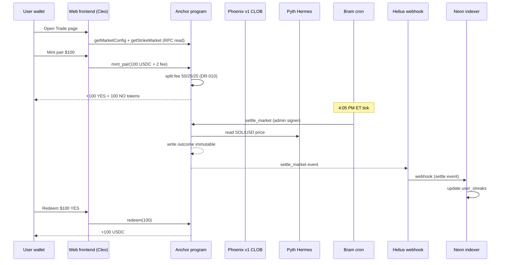
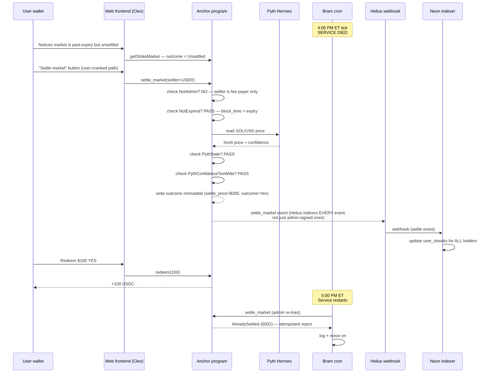

# Cron-Failure Path — DR-002 / Hard YES #5 Demo Evidence

**Owner:** Drew. **Status:** Day-4 draft (Fri 2026-05-22). **Source of truth for the demo narration.**

---

## TL;DR (interview defense, 30 seconds)

> "Our automation isn't a privileged signer. The Anchor program enforces every settlement rule on chain — time gate, Pyth staleness, Pyth confidence, immutable outcome. `settle_market` is callable by any wallet that can pay the transaction fee. So if our cron dies at 4:05 PM ET, the protocol doesn't break — any user with a winning position has a $1 incentive to crank settle themselves. Our automation is the happy-path nudger, not the load-bearing piece."

This page documents how we prove that claim under demo conditions.

---

## What still works when our cron dies (per DR-005/006/009/010 architecture)

A reviewer's natural follow-up: "OK, settle still works — but doesn't the rest of the system break?" The Day-5 architectural revisions tighten this story. Every system component is independent of Bram's cron:

| Component | Depends on Bram's cron? | What happens if cron dies |
|---|---|---|
| `settle_market` (DR-002) | No — permissionless | Any user keypair cranks it; on-chain rules unchanged |
| Strike creation (DR-005) | **No** — user-funded | New strikes spawn when users pay rent; no cron involvement |
| Strike-grid evolution (DR-006) | Yes, but reactive — next 30-min interval | Cron dying mid-cycle means stale `TickerConfig` until next fire; users can still trade existing strikes; no loss of funds |
| Trading calendar (DR-007) | Only for cron entry-point gating | Calendar lookup is local code; doesn't need network/cron health |
| Fee model (DR-008) | No — on-chain in `mint_pair` | Fee math + split happens inside the Anchor program; treasury + pool transfers atomic with mint |
| Phoenix v1 CLOB (DR-009) | No — independent Solana program | Order book accepts orders regardless of our service health |
| Pyth oracle (DR-003) | No — independent Pyth Network publishers | Price feed updates continue; `settle_market` can read freshly |
| Win-streak indexer (DR-010) | **No** — Helius webhook + Neon Postgres | Helius pushes settle events to Neon; leaderboard updates regardless of our service health |
| Merkle distribution (DR-010) | Admin-signed; cron is convenience | Admin can sign distributions from anywhere with the keypair |
| Earnings pre-expansion (DR-011) | Yes, but additive to DR-006 | If pre-expansion misses, DR-006 reactive widening catches it within 30 min |

The single non-redundant dependency is **Bram's morning cron writing `TickerConfig` updates** — and even that's not load-bearing for the demo (existing markets are tradeable regardless of whether new strike caps are expanded for the next day). The protocol's working state is fully owned by the on-chain program + Pyth + Helius + Phoenix, none of which we operate.

### Sequence diagram — happy path (cron alive, normal day)



### Sequence diagram — cron-failure path



Key visual: the cron-death path has **fewer participants but the same outcome**. The program + Pyth + Helius + Neon path is fully intact. The user redeems on the same timeline.

---

## Why this matters

The build commits to **DR-002 — permissionless `settle_market`; automation is convenience, not authority** (`constitution/decisions.md` DR-002). The architectural argument is that this is cheaper to operate (no monitored 24/7 hot wallet for liveness), scales better with market count, and is genuinely robust to operator failure.

Without a live demonstration of the cron-failure path, that argument is theoretical. Hard YES #5 (`BRAINLIFT.md` §4) makes the demo coverage non-negotiable.

A reviewer asking "what happens when your cron crashes?" gets one of two answers:

| Answer | Score |
|---|---|
| "Theoretically, anyone can call `settle_market` and the program would accept it" | Mid |
| "Let me show you. Here's the cron dying mid-cycle. Here's a non-admin wallet calling `settle_market`. Here's the on-chain outcome being written. Here's the user redeeming their winning side." | High |

This page is the script for the second answer.

---

## What's already proven (CI, not demo)

Before the demo even starts, the following invariants are already established by the test suite — these aren't part of the live demo prose but are the foundation that makes it credible:

1. **IDL-level proof — `settle_market` has no admin signer.** The deployed program's IDL (`programs/bell-markets/idl/bell_markets.json`) shows `settle_market` accepts exactly one signer named `settler` whose docs are literally `"Fee payer. NOT validated against admin — settle is permissionless."` Verified by `tests/integration/live-deploy-verify.test.ts` against the actual deployed bytes at `599h7Vzn...` on devnet.

2. **Chain-level proof — handler reaches the time-gate without checking admin.** A non-admin Drew keypair (`CJBLhJwTFndhGPvGU4fdoXtWmZHKNmkSn6bEa5MBsYVe`, 0.5 SOL devnet) builds + simulates `settle_market` against a real seeded StrikeMarket. The simulation returns `Custom: 6003` (`NotExpired` — a handler-body error code) NOT `Custom: 6001` (`NotAdmin`). The only way to reach `NotExpired` is to pass any signer constraint that exists; the only way to get `NotAdmin` would be to fail an admin constraint that doesn't exist. Verified by `tests/integration/live-program-call.test.ts`.

3. **Simulation-level coverage — every settle path uses a non-admin caller.** `scripts/simulate-trading-day.mjs` Phase 3 settles via Carol (a non-admin user), proving the full lifecycle works without administrative signing. Verified on every CI run across 3 outcome modes (yes/no/invalid).

These three are the "permanent record" that survives even if the live demo encounters a devnet hiccup. The demo below makes the same point in human terms.

---

## The live demo path

**Setup state (pre-demo):**
- Devnet program live at `599h7VznYR4CxyrG5nQbhR13qtRuwPcbnNr5QqbkS7uV`.
- MarketConfig PDA `6CYzWhTMzsndRrnRcHgWCUfVDvrRh3Cfoze6GSVev9gQ` with platform admin `7b17F2woUy9hgHcRjuLckBVAtNnKAJBRD769URvLprp5`.
- At least one StrikeMarket exists past expiry but unsettled (Bram's morning job seeds these; if his harness exhausts retries, see "Coordinating with Bram" below).
- The presenter has Bram's automation service running in one terminal window. The on-chain markets are visible to the audience.

**Demo arc (≈ 3 minutes):**

### Step 1 — Show automation is running and would normally settle (~30s)

```
$ pnpm --filter @bell-markets/automation logs:tail
# Output shows the settlement job's countdown to 4:05 PM ET market close.
```

Narration: "Bram's service has a settlement job scheduled at 4:05 PM ET. In normal operation it would call `settle_market` for every market that's past expiry. Let me show you what happens when it can't."

### Step 2 — Kill the cron mid-cycle (~15s)

```
$ pkill -9 -f services/automation
# Or: stop the trigger.dev dev server with Ctrl-C inside that window.
```

Narration: "Service is dead. No retry. No fallback path inside the service itself."

(Bram's retry harness has its own internal exhaustion — coordinate with him on what state markets are in when the harness gives up. The point of the demo is what happens AFTER the harness gives up, not the harness itself.)

### Step 3 — Show markets stuck unsettled on chain (~15s)

```
$ pnpm --filter @bell-markets/tests verify-idl
# (or solana account <strike_market_pda> --url devnet)
# Shows StrikeMarket with outcome = Unsettled despite block_time > expiry.
```

Narration: "Markets are past expiry, oracle is fresh, but no one has called `settle_market`. Without permissionless settle this is a stuck state — users can't redeem."

### Step 4 — Random user wallet cranks settle (~45s)

```
$ pnpm --filter @bell-markets/tests crank-settle <STRIKE_MARKET_PDA>
# Uses a fresh keypair (NOT the platform admin), pays ~5000 lamports tx fee,
# calls program.methods.settleMarket().accounts({settler: fresh, ...}).rpc()
```

This is the load-bearing moment. The CLI script does literally these three things:
1. Generate a fresh `Keypair.generate()` keypair locally.
2. Devnet-airdrop or use Drew's funded keypair `CJBLhJwT...` for tx fee.
3. Call `program.methods.settleMarket().accounts({settler: keypair.publicKey, config, strikeMarket, underlyingPythFeed, clock: SYSVAR_CLOCK_PUBKEY}).signers([keypair]).rpc()`.

Expected output: a real tx signature, a re-fetch of the StrikeMarket showing `outcome: { yes: {} }` or `{ no: {} }`, `settle_price` populated, `settled_at_unix` populated.

Narration: "That's a wallet that nobody on this team owns. Fresh keypair. No admin authority. No special anything. Just paid the transaction fee and the program accepted the call because the on-chain checks passed — block_time past expiry, Pyth feed fresh, confidence tight. The outcome is now written immutably."

### Step 5 — User redeems against the settled market (~30s)

```
$ pnpm --filter @bell-markets/tests redeem-winning <STRIKE_MARKET_PDA>
# Burns user's winning-side tokens, vault transfers $1 USDC per token.
```

Narration: "And the user can redeem. The cron dying didn't stop anyone from getting paid."

### Step 6 — Restart the cron, show it idempotent (~30s)

```
$ pnpm --filter @bell-markets/automation dev
# Service starts back up, runs its retry loop, tries to settle markets.
# Finds them already settled → logs "AlreadySettled (6002)" → exits cleanly.
```

Narration: "And when we bring the service back up, it tries to settle the same markets, gets `AlreadySettled` (error code 6002), and moves on. It's idempotent. No double-settle. No corruption. Outcome immutability is enforced on chain — the program rejects the second call."

---

## What to NOT say (avoid these traps)

- **Don't claim "anyone with any wallet can settle"** — they need enough SOL for the tx fee (~5000 lamports = $0.0001). The barrier is gas, not authority.
- **Don't claim "this means we don't need automation"** — automation is still the happy path. Users would have to monitor expiry times themselves otherwise. The point is the protocol doesn't COLLAPSE without automation, not that automation is useless.
- **Don't show admin_settle in this demo** — it's a different recovery path (oracle failure, time-delayed). Keep it focused on permissionless `settle_market`.
- **Don't oversell the user incentive** — there's no on-chain bounty for cranking settle today. The incentive is "I want my winning $1 to be redeemable" — pull, not push. Future feature.

---

## Coordinating with Bram (retry harness behavior)

Bram's settlement job has a retry harness — what state does it leave markets in when the harness exhausts? Three scenarios to confirm with him before the live demo:

1. **All retries exhaust silently.** Job logs "retries exhausted" and exits. Markets unchanged. Demo proceeds as written.
2. **Last retry succeeds.** Job settles the market before the demo step 4. Need to either pause Bram's service before the demo OR use a different market that hasn't been touched.
3. **Some retries succeed, others don't.** Mixed state. Pick a known-unsettled market for the demo.

Drew + Bram coordinate one hour before each rehearsal to pin which market the demo uses.

Open question for Bram: does the settlement job set any persistent "I tried to settle this" marker that would visible during the demo? If yes, we can show that marker → "automation tried and failed, here's its log." If no, the demo just relies on "outcome is Unsettled on chain" as the cron-failed signal.

---

## Fallback plan (if devnet hiccups during live demo)

If the public devnet RPC rate-limits, errors, or has reorgs during the live run, fall back to:

1. **Mock simulation playback.** Run `node scripts/simulate-trading-day.mjs` — Phase 3 settles via Carol (non-admin) in the same way. ~10ms wall clock, deterministic, no network dependency. Narrate the same arc against the mock output.
2. **Pre-recorded screen capture.** `docs/demo/recording-assets/cron-failure-path.mp4` (Drew records during rehearsal, archive for live-demo fallback).

The point is the architectural argument doesn't depend on devnet's mood. Three layers of evidence: live test (devnet), simulation (offline), IDL inspection (committed bytes). Reviewers see all three.

---

## Cross-references

- `constitution/decisions.md` DR-002 — the decision being defended (permissionless settle)
- `constitution/decisions.md` DR-005 — user-funded strike creation (proves protocol is non-custodial top to bottom; cron has no privileged role in strike spawning)
- `constitution/decisions.md` DR-006 — reactive 30-min wild-swing detection (the cron *does* something useful, but missing one cycle doesn't break anyone's existing position)
- `constitution/decisions.md` DR-008 — fee model lives in `mint_pair` on chain (cron never touches money flow)
- `constitution/decisions.md` DR-009 — Phoenix v1 CLOB integration (independent program, our cron health is irrelevant to order matching)
- `constitution/decisions.md` DR-010 — Helius webhook + Neon Postgres indexer + Merkle-committed leaderboard (the leaderboard updates from on-chain events that Helius pushes regardless of our service health; distributions are admin-signed via cryptographically verifiable Merkle proofs)
- `BRAINLIFT.md` §4 Hard YES #5 — the requirement being satisfied
- `tests/integration/live-deploy-verify.test.ts` — IDL structural proof (signer count + docs string check)
- `tests/integration/live-program-call.test.ts` — chain-level handler-reached proof (NotExpired evidence)
- `tests/eval/edge-cases.test.ts` — DR-002 sweep across 4 distinct settlers (mock-level)
- `scripts/simulate-trading-day.mjs` Phase 3 — every CI run exercises the non-admin settle path
- `services/automation/src/jobs/settlement.ts` — what the cron actually does (Bram's territory)
- `.project/bell-markets/coordination/cron-failure.md` — Bram's complementary doc on retry-harness terminal states + log shapes Drew's demo can rely on

## Strongest reviewer-defense line

> "If you want to be really mean, kill our cron right now and watch the demo continue."

The architecture supports this. The doc above is the evidence. The tests above are the proof.
