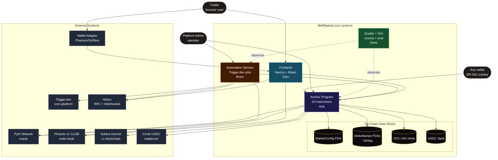
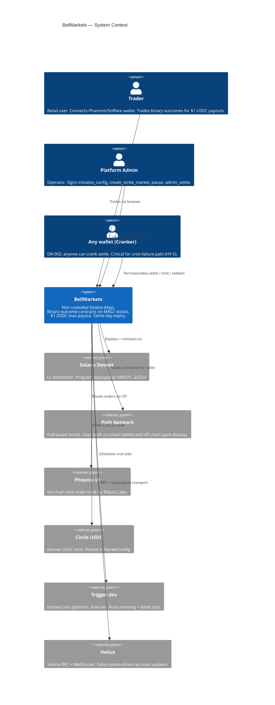
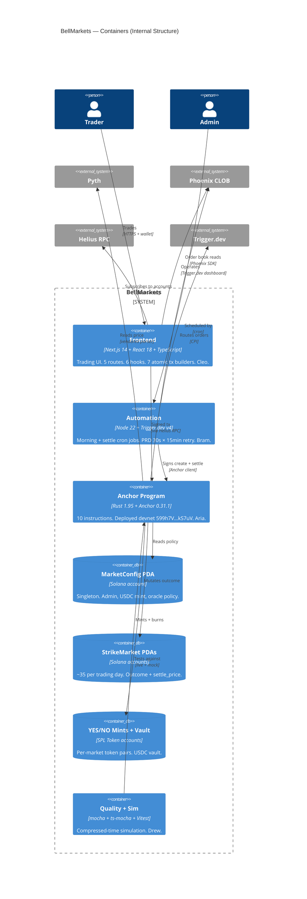
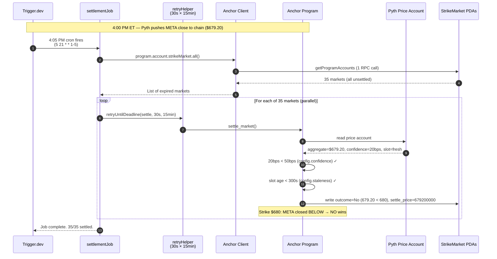
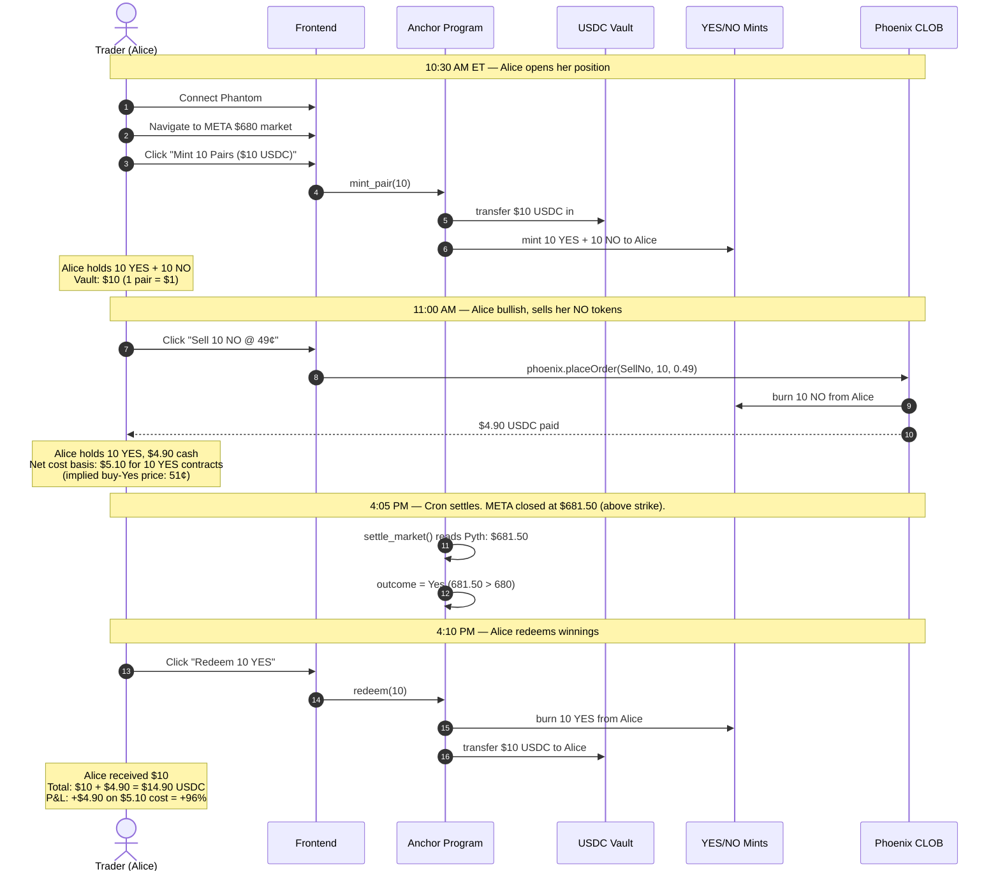

# BellMarkets — System Overview (Diagrams)

Everything in this file renders inline in GitHub, Cursor's markdown preview,
Notion, and most static-site generators. No tooling. No dev server.

This is the "single picture per question" companion to the deeper LikeC4
model at `docs/architecture/` (which is for interactive exploration).

---

## 1. System Flowchart — Where Each Piece Lives

A top-down view of the whole system in one diagram.

**Key takeaways:**
- The system has 4 internal workstreams (color-coded by lead).
- The Anchor Program is the only thing on-chain; everything else is off-chain.
- DR-002 lets *anyone* (Cranker) call the program — automation is convenience, not authority.
- The trader's private key never crosses into BellMarkets — Wallet Adapter is the trust boundary.

---

## 2. C4 Context — Standard C4 Notation

Same picture as above, but in the formal C4 Context shape that
architecture reviewers expect.

---

## 3. C4 Container — Inside BellMarkets

Zoom into the system. Shows the 4 workstream containers + their owned data.

---

## 4. Sequence — Trader Buys "No" (POV-3 Atomic)

The signature UX commitment. One signature. Two on-chain instructions
bundled atomically. If either fails, both revert.

```mermaid
sequenceDiagram
    autonumber
    actor T as Trader
    participant W as Wallet (Phantom)
    participant F as Frontend
    participant P as Anchor Program
    participant V as USDC Vault
    participant M as YES/NO Mints
    participant X as Phoenix CLOB

    T->>F: Click "Buy No @ 48¢"
    F->>F: buildBuyNo(amount=1)<br/>composes 2-ix atomic tx:<br/>1. mintPair(1)<br/>2. phoenix.sellYes(1)
    F->>W: Request signature<br/>(simulate + present)
    W->>T: Show "approve tx with 2 ix"
    T->>W: Sign once
    W-->>F: Signed tx
    F->>P: Submit transaction

    rect rgb(40, 70, 40)
        Note over P,X: ATOMIC EXECUTION (both succeed or both revert)
        P->>V: ix0: transfer $1 USDC from trader → vault
        P->>M: ix0: mint 1 YES + 1 NO → trader ATA
        P->>X: ix1: place sell order on YES asks
        X->>M: burn YES from trader (Phoenix maker takes)
        X->>T: pay 48¢ USDC (filled at ask)
    end

    Note over T: Net result:<br/>Paid $1.00 to mint pair<br/>Received $0.48 selling YES<br/>Net cost: $0.52 for 1 NO contract<br/>Wins $1 if META < $680
```

**Why one signature matters:** competitors force users through 2 separate
transactions (mint, then sell). That's slower, more error-prone, and
breaks the "I am buying No" mental model. POV-3 says: the user thinks
"Buy No" — the system should execute "Buy No," not expose the primitives.

---

## 5. Sequence — Daily Settlement (Happy Path)

What happens at 4:05 PM ET every weekday.

**Retry harness detail:** if Pyth confidence is wide at 4:05 (common — high
volatility around close), the retry harness re-attempts every 30s for 15
minutes. Each market retries independently — one slow market doesn't
block the other 34.

---

## 6. Sequence — When the Cron Fails (DR-002 / HY-5)

The architectural commitment that makes BellMarkets actually
non-custodial. If Bram's automation dies, the protocol still works.

```mermaid
sequenceDiagram
    autonumber
    participant T as Trigger.dev
    participant J as settlementJob
    participant H as Helius RPC
    participant C as Any wallet<br/>(Cranker)
    participant P as Anchor Program
    participant Py as Pyth Oracle
    participant SM as StrikeMarket

    rect rgb(80, 40, 40)
        Note over T,H: SCENARIO: Trigger.dev outage at 4:05 PM
        T--xJ: ❌ cron does not fire
    end

    Note over T,H: ...20 minutes pass. Markets still unsettled.

    rect rgb(40, 60, 80)
        Note over C,P: HY-5 / DR-002 path: any wallet rescues the protocol
        C->>H: I notice market is unsettled past expiry
        C->>P: settle_market() with MY OWN keypair (not admin)
        P->>P: check expiry_unix < now ✓
        P->>P: check outcome.is_none ✓
        P->>P: check signer == ? ← NO CHECK. Permissionless.
        P->>Py: read price account
        Py-->>P: $679.20 (same as cron would have read)
        P->>SM: write outcome=No, settle_price=679200000
        P-->>C: settled successfully
    end

    Note over C,SM: Cranker burns 5,000 lamports of gas.<br/>Cron failure = $0 protocol impact.<br/>Demo evidence for HY-5.
```

**Why this is defensible:** every binary-options platform claims to be
"decentralized." Most require their backend to settle. Kill the backend,
kill the protocol. We refused that — settle is unconditionally
permissionless. The cron is convenience for the 99% case where everything
works; the protocol survives the 1%.

---

## 7. Sequence — Full Trader Lifecycle (Mint → Trade → Settle → Redeem)

Zoomed out: what a single trader's journey looks like over a day.

---

## 8. Data Flow — Pyth Price → On-Chain Settle

How a stock price moves from Pyth into our settle outcome.

```mermaid
flowchart LR
    Market[Stock Market<br/>NYSE / NASDAQ] -->|trades| Pubs[Pyth Publishers<br/>20+ market makers]
    Pubs -->|signed price reports| PythAgg[Pyth Aggregator<br/>off-chain]
    PythAgg -->|push price + confidence| PythAcct[Pyth Price Account<br/>on-chain PDA]
    PythAcct -->|read| Parser[Vendored Pyth Parser<br/>30 lines, no SDK]
    Parser -->|aggregate + slot + conf| Settle[settle_market]
    Settle -->|"outcome = price ≥ strike"| Market2[StrikeMarket PDA<br/>outcome + settle_price]

    style Market fill:#1f2937,color:#fff,stroke:#9ca3af
    style PythAcct fill:#5b21b6,color:#fff,stroke:#8b5cf6
    style Parser fill:#5b21b6,color:#fff,stroke:#8b5cf6
    style Settle fill:#1e1b4b,color:#fff,stroke:#8b5cf6
    style Market2 fill:#451a03,color:#fff,stroke:#fbbf24

    classDef policy fill:#0c0a0a,stroke:#fbbf24,color:#fff
    P1[/staleness < 300s/]:::policy
    P2[/confidence < 50bps/]:::policy

    Parser --> P1
    Parser --> P2
    P1 -->|else: PythStale| Settle
    P2 -->|else: PythConfidenceTooWide| Settle
```

The two policy gates (staleness + confidence) come from MarketConfig.
If either fails, settle reverts → retry harness loops. If they keep
failing for 1 hour past expiry, admin can override with `admin_settle`.

---

## How to use these diagrams for interview defense

| Question they ask | Diagram to open |
|---|---|
| "Walk me through your architecture" | §1 System Flowchart |
| "What about industry standard notation?" | §2 + §3 C4 Context + Container |
| "Tell me about the trading UX" | §4 Buy No sequence |
| "What happens at settlement?" | §5 Daily settle sequence |
| "What if your cron service goes down?" | §6 Permissionless settle sequence |
| "Walk me through a full user journey" | §7 Mint → trade → settle → redeem |
| "How does the oracle integration work?" | §8 Pyth data flow |

Each section is ~2-3 minutes of narration. Full set ~15 minutes if asked
to walk through everything.

---

## Editing

These are pure Markdown + Mermaid code blocks. Edit in any editor.
Preview in:
- Cursor / VS Code (built-in markdown preview)
- GitHub (renders Mermaid in `.md` files natively)
- `npx markserv .` for a local server
- Any markdown tool

If a diagram outgrows readability, split it into two. If the same
relationship appears in multiple diagrams, that's fine — Mermaid
diagrams are *views*, not a single source of truth (that's the LikeC4
model at `docs/architecture/`).
