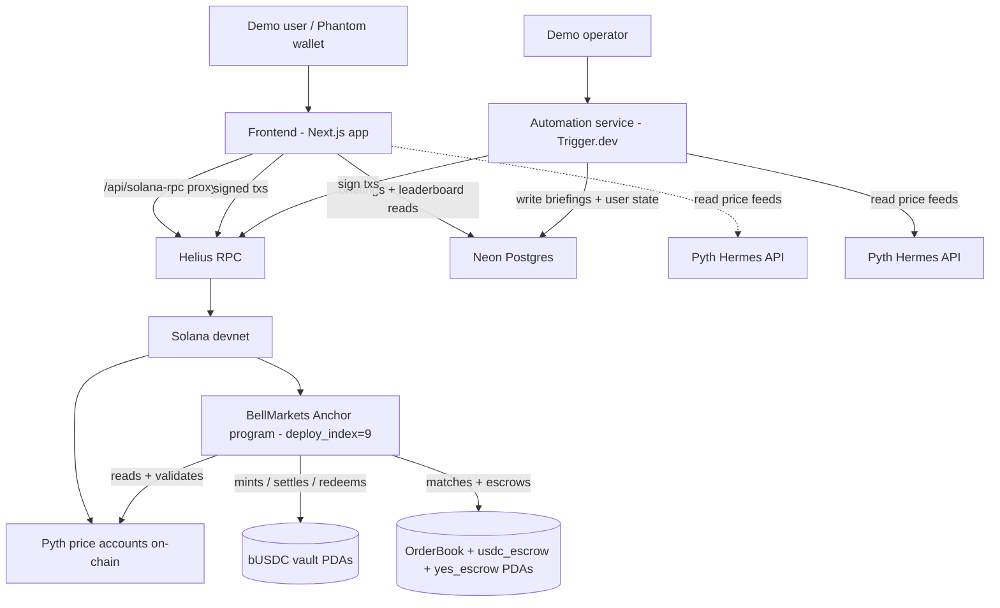

# BellMarkets — Architecture

> System shape. Components, deployment, data flow, verification approach.
> When this file disagrees with code, fix one or the other — don't leave the gap.
>
> Companion to `BRAINLIFT.md` (the 1-page constitution). This file holds
> the heavyweight architectural detail (repo layout, type signatures,
> data model, deployment, dependencies) that doesn't fit in the brainlift.
>
> **Status:** Refreshed 2026-05-25 post-DR-020 (Phoenix → in-program CLOB pivot) + post-deploy_index=9. Where this file disagrees with `constitution/decisions.md`, the DR file wins.

---

## 1. Overview

BellMarkets is a **non-custodial Solana dApp + off-chain orchestration service + browser frontend + Neon DB product surface** that lets users trade YES/NO binary outcome tokens against bUSDC for the question *"Will [STOCK] close above [PRICE] today?"* on the MAG7 universe. Settlement is driven by an on-chain Pyth price read shortly after 4:00 PM ET. **The on-chain CLOB is in-program** — a bounded price-time-priority matcher inside the Anchor program (DR-020, supersedes DR-001 after Phoenix devnet bootstrap proved impractical). Daily lifecycle (morning create-markets job at ~8am ET, post-close grid evolution at 4:05pm ET) is orchestrated by an off-chain TypeScript service on Trigger.dev, but `settle_market` is permissionless so the system functions even if the orchestration service is offline (per DR-002). Solana is canonical for funds; Neon Postgres serves product surface (users, OAuth, AI briefings, notification prefs) — per DR-003 amended.

### System diagram



Three runtime surfaces: frontend (Cleo), automation service (Bram), on-chain program (Aria). Drew owns the integration glue (test paths through all three) and the demo orchestration.

---

## 2. Components

### 2.1 Onchain — BellMarkets Anchor program

**Responsibility:** authoritative state + the load-bearing invariants + the **in-program matcher** (DR-020). Holds bUSDC vault + USDC/YES escrows per market, mints YES/NO SPL tokens, enforces the $1 invariant, validates Pyth for settlement, runs price-time-priority matching with three-phase execution (plan/settle/apply), immutably writes outcomes, pays out on redeem. **Does NOT** schedule the lifecycle (off-chain — DR-002) or enforce position-exclusivity (frontend — Hard YES #8).

**Tech:** Rust + Anchor framework (Anchor 0.31.1 / Solana 3.1.14 / Rust 1.95 per LESSONS.md-validated toolchain triple). SPL Token program for YES/NO mints + bUSDC vault. **Vendored 30-line Pyth price-account parser** at `programs/bell-markets/src/oracle.rs` for on-chain price reads — `pyth-sdk-solana` NOT used (Borsh cascade per `hard-rules.md` §4.13). `OrderBook` PDA uses Anchor's `zero_copy` + `AccountLoader` pattern for the 16,448-byte fixed-size order book (128 orders/side). All `Account<T>` fields in instruction `Accounts` structs are `Box<Account<'info, T>>` (`hard-rules.md` §4.10). Dormant Phoenix adapter code remains in the program for Phoenix-as-secondary-venue v2 candidate (DR-009 deferred under DR-020).

**Instructions exposed (28 total at deploy_index=9):**
- `initialize_config` — admin sets up global config (supported tickers, Pyth feed map, admin authority, override delay)
- `initialize_fee_config` / `update_fee_config` — admin sets up + updates fee bps + distribution weights
- `initialize_rewards_pools` / `reinit_rewards_pools` — admin sets up the leaderboard reward pools (the reinit ix handles bUSDC mint migration mid-flight)
- `update_ticker_config` — admin sets per-ticker strike grid + max user-strike deviation + tick size
- `create_strike_market` — admin creates one strike. Initializes YES/NO mints + bUSDC vault. Does NOT set `order_book` (set by `grow_order_book`).
- `user_create_strike_market` — user-funded strike PDA creation (DR-005). On-chain deviation + tick-alignment + Pyth staleness checks.
- `add_strike` — convenience hook
- `mint_pair` — anyone deposits bUSDC → receives equal YES + NO tokens (DR-008 mint fee + creator-rebate logic applied)
- `init_order_book` — phase 1 of order-book PDA init (10 KB initial alloc; fits Solana's `MAX_PERMITTED_DATA_INCREASE`)
- `grow_order_book` — phase 2: realloc to `OrderBook::LEN = 16,448 B`; sets `strike_market.order_book` (the trading gate)
- `place_order(side, price, size, is_market)` — DR-020 matcher entry point. Three-phase: plan fills → settle CPI per fill (PDA-signed) → apply book updates. Market orders are fill-or-cancel; remaining limit-side rests.
- `cancel_order(side, seq)` — owner-only. Refunds exact remaining escrow. Allowed even when paused/settled (Keith's L-2 invariant: users must always reclaim escrow).
- `match_orders` — permissionless crank for crossed-but-unmatched book (normal state is uncrossed; this is the safety crank)
- `redeem_pair` — burn equal YES + NO → $1 bUSDC per pair (works pre- or post-settle; powers Sell NO atomicity)
- `redeem` — post-settle Yes/No only. Burn winning tokens → receive $1 bUSDC from vault.
- `redeem_invalid` — post-Invalid markets only (Pyth-unrecoverable scenarios + admin override)
- `force_redeem` — admin-only post-settle, grace-period gated, for stuck winning positions
- `settle_market` — **permissionless** (DR-002). Validates expiry + Pyth staleness + Pyth confidence; writes outcome immutably.
- `admin_settle` — admin-only fallback. On-chain time-delay gate (≥1hr after settlement window — Hard YES #7).
- `close_settled_market` — permissionless. Closes USDC vault (rent → fee_collector). Gated on `pairs_outstanding == 0` + `vault.amount == 0`. **Does not close OrderBook or escrows** — `force_cancel_order` + `close_order_book` are v1.1 deferred (see `specs/deferred.md`).
- `pause(paused)` — admin emergency stop. Does NOT block `cancel_order`.
- `update_usdc_mint(new_mint)` — admin one-shot migration (used for bUSDC switchover)
- `commit_leaderboard_root` / `distribute_weekly_rewards` / `distribute_monthly_rewards` — Merkle-distribution surface for the leaderboard rewards pools
- `pause` / `unpause` — admin emergency stop on minting + new trades.

**Talks to:** Solana runtime (token program, system program), Pyth price accounts (on-chain account read), own OrderBook PDA via Anchor's zero-copy `AccountLoader`. The dormant Phoenix CPI surface remains in the program for v2 secondary-venue candidate work but is not exercised by any current trade flow.

**Owned by:** Aria. See `constitution/file-ownership.md`.

### 2.2 Off-chain — Automation Service (Bram)

**Responsibility:** orchestrate the daily lifecycle without becoming an authority. Two scheduled jobs:

- **Morning job (~8am ET):** for each MAG7 stock, read previous close from Pyth HTTP API, compute strikes (±3%/6%/9% from previous close, rounded to $10, deduplicate), call `create_strike_market` per unique strike. Logs results, alerts on failure, retries with backoff.
- **Settlement nudger (~4:05pm ET):** for each open contract, call `settle_market` (best-effort convenience caller — not authority). If Pyth confidence is too wide, retries every 30s for up to 15min. If still failing, alerts the admin for manual `admin_settle` override.

**Crucially:** the settlement nudger has no special signing authority over `settle_market` (per DR-002). It's a convenience caller. If it dies, any user can call `settle_market` themselves; the system still works.

**Tech:** Node.js + TypeScript. Solana web3.js + Anchor client via Helius RPC. **Trigger.dev (free tier)** as the cron platform — handles the morning + settlement-nudger schedules natively. No long-running process required; jobs run on Trigger.dev's infra. Stateless (no persistent DB per `constitution/hard-rules.md` §3.3). pnpm workspaces.

**Talks to:** Pyth HTTP API (off-chain price reads), Helius RPC (transaction signing + submission), the BellMarkets program (via Anchor client).

**Owned by:** Bram. See `constitution/file-ownership.md`.

### 2.3 Frontend — Next.js trading app (Cleo)

**Responsibility:** present the market, accept trade intent, sign transactions via the connected wallet, render real-time book + portfolio state, enforce position-exclusivity at the UX layer.

**Pages:**
- `/` — Landing: product explanation, live prices, connect-wallet CTA
- `/markets` — grid of 7 MAG7 stocks with live prices and active contract counts
- `/trade/[ticker]/[strike]` — strike-specific view: order book (YES bid/ask ladder; NO is derived from YES via complementary identity `price(NO) = $1 − price(YES)`), Buy YES / Buy NO / Sell YES / Sell NO panel with position-aware constraints, settlement countdown
- `/portfolio` — active positions, settled outcomes, P&L, redeem buttons
- `/history` — trade execution log

**Tech:**
- **Next.js 14.2.18** (App Router) — pinned per LESSONS.md as "stable with `@solana/wallet-adapter`"
- **React 18** + TypeScript (strict mode) — pinned per LESSONS.md; React 19 deferred until wallet-adapter ecosystem catches up
- `@coral-xyz/anchor` JS client **0.30.1**
- `@solana/wallet-adapter-react` for wallet integration (Phantom, Backpack, Solflare). Per Hard YES #10: no in-app keystore, no env-var private keys.
- `connection.onAccountChange` (Helius WebSocket) for real-time book + portfolio updates. **No polling** (Hard YES #9 / `hard-rules.md` §4.8).
- TanStack Query for RPC caching, dedup, and the WebSocket → cache bridge (`queryClient.setQueryData` from inside the subscription handler)
- Zustand for ephemeral UI state (open modals, selected strike, panel filters)
- Tailwind CSS + shadcn/ui components (Radix-based, copy-paste)
- **No confirmation modal** on trade actions — we deliberately rejected this. The wallet's tx simulation already shows state changes; an extra modal duplicates information without adding any, slows the trade (latency-sensitive UX), and degen traders dislike friction. User education for composite-tx flows (Buy NO / Sell NO bundling `mint_pair + place_order` / `place_order + redeem_pair`) lives in `docs/USER-GUIDE.md` instead.

**Buy NO / Sell NO atomicity (POV-3):** Each user click → ONE wallet-signed transaction that bundles all required instructions. Buy NO = `[mint_pair, place_order(SELL_YES, IOC)]` in one tx. Sell NO = `[place_order(BUY_YES, IOC), redeem_pair]`. The user never sees a "mint pair" button, never sees intermediate YES balances. Per `hard-rules.md` §4.7. **DR-019 amendment:** Limit-side NO trades are disabled (NO is market-only) because a resting Limit NO would strand fees on cancel.

**Talks to:** Helius RPC (read + WebSocket) via server-side proxy at `/api/solana-rpc`, user's wallet (signing), the BellMarkets program (via Anchor client + custom tx builders for the four atomic flows), Neon Postgres (read user state + briefings + leaderboard via `/api/*` routes).

**Owned by:** Cleo. See `constitution/file-ownership.md`.

### 2.4 Quality + Demo — Integration & eval harness (Drew)

**Responsibility:** prove the system works end-to-end. Property-based tests for the $1 USDC invariant. Integration tests that exercise the full lifecycle on devnet. The "one-command demo" script. The cron-failure-path demo step (Hard YES #5).

**Tech:** Anchor test framework via mocha + chai + ts-mocha (Anchor default) — also used by Drew's cross-cutting integration + eval tests in `tests/integration/` + `tests/eval/`. **Vitest** for the automation service (`services/automation/`). **Jest** for the frontend app (`apps/web/`). The test-runner split is intentional: each runner is the native default for its language/framework ecosystem (mocha for Anchor; Vitest for ESM-first TS service; Jest for Next.js frontend). **Primary invariant verification: compressed-time lifecycle simulation** at `scripts/simulate-trading-day.mjs` (60s = 1 trading day, ≥3 wallets, multi-user contention — per LESSONS.md Lesson 10). Supplemented by parameterized mocha tests for specific edge cases (at-strike, double-redeem, stale Pyth, settle-before-window, admin-settle-without-delay). Mocked Pyth feeds for deterministic CI (Hard NO #12); live Pyth reads only behind `LIVE_ORACLE=1` env flag for devnet integration runs. Note: `proptest` (Rust) and `fast-check` (TypeScript) were considered and dropped — the compressed-time simulation catches multi-user contention bugs that property-based per-function tests miss, and adding a new property-testing framework on a 3-day window has too high a learning-curve tax.

**Owned by:** Drew. See `constitution/file-ownership.md`.

---

## 3. Data model — on-chain accounts (the only persistent state)

There is no off-chain database (per `hard-rules.md` §3.3). On-chain state is the source of truth.

### Core account schemas

```rust
// programs/bell-markets/src/state/

#[account]
pub struct MarketConfig {
    pub admin: Pubkey,              // admin authority
    pub paused: bool,               // pause/unpause toggle
    pub supported_tickers: Vec<Ticker>,
    pub pyth_feed_map: Vec<(Ticker, Pubkey)>,  // ticker → Pyth price account
    pub staleness_threshold_sec: u64,   // default 300 (5 min)
    pub confidence_threshold_bps: u64,  // default 50 (0.5%)
    pub admin_override_delay_sec: u64,  // default 3600 (1 hour)
}

#[account]
pub struct StrikeMarket {
    pub ticker: Ticker,             // "AAPL", "MSFT", ...
    pub strike: u64,                // USDC, 6-decimal units (e.g., $680 = 680_000_000)
    pub settlement_window: i64,     // unix timestamp; settleable when block_time >= this
    pub yes_mint: Pubkey,           // SPL Yes-token mint
    pub no_mint: Pubkey,            // SPL No-token mint
    pub vault: Pubkey,              // program-owned USDC vault PDA
    pub phoenix_market: Pubkey,     // Dormant per DR-020; retained for v2 secondary-venue candidate
    pub order_book: Pubkey,         // OrderBook PDA — trading gate (set by grow_order_book)
    pub pyth_feed: Pubkey,          // Pyth price account for this ticker
    pub outcome: Option<Outcome>,   // None until settled; Some(...) is immutable
    pub pairs_outstanding: u64,     // count of un-redeemed mint pairs
    pub created_at: i64,
    pub settled_at: Option<i64>,
}

pub enum Outcome {
    YesWins,    // close >= strike  →  Yes pays $1, No pays $0
    NoWins,     // close <  strike  →  Yes pays $0, No pays $1
}

pub type Ticker = [u8; 8];   // null-padded ticker string, max 8 chars
```

### Invariants — enforced on-chain, verified by Drew's property tests

| Invariant | Where enforced | Drew's test coverage |
|---|---|---|
| `vault.amount == 1_000_000 * pairs_outstanding` (vault has $1 per open pair) | `mint_pair`, `redeem` | Property test sweeps (mint count × redeem count × settle outcome) |
| `yes_payout + no_payout == 1_000_000` for all outcomes (the $1 invariant) | `settle_market`, `admin_settle` | Property test sweeps (close_price × strike × outcome) |
| Outcome is `Some(...)` and never changes once written | `settle_market`, `admin_settle` | Negative test: attempt second settle, assert it fails |
| Tokens can only be created via `mint_pair` and destroyed via `redeem` | SPL Token program authority (program-owned mints) | Negative test: unauthorized mint/burn, assert it fails |

### PDAs (seeds)

```
StrikeMarket   : ["strike_market", ticker, strike_le_bytes, day_le_bytes]
Vault          : ["vault", strike_market.key()]
YesMint        : ["yes_mint", strike_market.key()]
NoMint         : ["no_mint", strike_market.key()]
```

**Schema changes after first devnet deploy require a fresh deploy** — see `BRAINLIFT.md` §4 "flag for review."

---

## 4. Off-chain types (TypeScript)

### Frontend view models

```ts
// apps/web/lib/types.ts

export type StrikeMarketView = {
  marketId: PublicKey;
  ticker: string;
  strike: number;              // USDC, human-readable
  yesBidPrice?: number;        // from on-chain OrderBook PDA (best bid)
  yesAskPrice?: number;
  noBidPrice?: number;         // = 1 - yesAskPrice (implied)
  noAskPrice?: number;         // = 1 - yesBidPrice (implied)
  impliedYesProbability?: number;  // midpoint of yes bid/ask
  settlementWindow: Date;
  outcome?: "YesWins" | "NoWins";
  isSettled: boolean;
};

export type UserPosition = {
  marketId: PublicKey;
  yesBalance: number;
  noBalance: number;
  // Constraint: only one of {yesBalance, noBalance} is non-zero from trading
  // (a transient both-nonzero state during mint-pair is OK; persistent both is a frontend bug)
};

export type TradeIntent =
  | { kind: "BuyYes"; marketId: PublicKey; usdcAmount: number; orderType: "market" | { limit: number } }
  | { kind: "BuyNo"; marketId: PublicKey; usdcAmount: number; orderType: "market" | { limit: number } }
  | { kind: "SellYes"; marketId: PublicKey; yesAmount: number; orderType: "market" | { limit: number } }
  | { kind: "SellNo"; marketId: PublicKey; noAmount: number; orderType: "market" | { limit: number } };

// Each TradeIntent translates to ONE atomic Solana transaction (POV-3).
```

### Automation service types

```ts
// services/automation/src/types.ts

export type StrikeSet = {
  ticker: string;
  previousClose: number;        // USDC equivalent
  strikes: number[];            // unique strikes after dedup, rounded to nearest $10
};

export async function computeStrikesForDay(date: Date): Promise<StrikeSet[]>;
export async function createMarketsForDay(strikeSets: StrikeSet[]): Promise<PublicKey[]>;
export async function settleMarketsForDay(markets: PublicKey[]): Promise<SettlementReport>;
// settleMarketsForDay is best-effort. If automation dies, anyone can crank settle themselves (DR-002).
```

---

## 5. Repo layout (target)

```
.
├── README.md
├── LICENSE                       # Apache 2.0
├── BRAINLIFT.md                  # 1-page constitution
├── CLAUDE_SESSION_HANDOFF.md     # Tate session continuity
├── constitution/                 # hard-rules.md, decisions.md, file-ownership.md, README.md
├── specs/                        # architecture.md (this file), bell-markets-spec.md, coordination.md, deferred.md, README.md
├── programs/                     # (Aria) Anchor program
│   └── bell-markets/
│       └── src/
│           ├── lib.rs            # program entry + instruction dispatch
│           ├── instructions/     # create_strike_market, mint_pair, settle_market, admin_settle, redeem, pause, add_strike
│           ├── state/            # MarketConfig, StrikeMarket, Vault account schemas
│           ├── oracle/           # Pyth read + validate (staleness, confidence)
│           └── errors.rs
├── services/
│   ├── automation/               # (Bram) morning + settlement-nudger
│   └── oracle-adapter/           # (Bram) Pyth HTTP API client
├── apps/web/                     # (Cleo) Next.js frontend
│   ├── app/                      # App Router: /, /markets, /trade/[ticker]/[strike], /portfolio, /history
│   ├── components/               # OrderBook, TradePanel, Portfolio, RedeemButton, etc.
│   └── lib/                      # solana/ (wallet, anchor client, order-book decoder), pyth/ (client-side feed read), tx/ (custom tx builders for the 4 atomic flows)
├── packages/ui/                  # shared shadcn components
├── tests/
│   ├── contracts/                # (Aria) Anchor unit tests + property tests for on-chain invariants
│   ├── automation/               # (Bram) service unit tests
│   ├── frontend/                 # (Cleo) component unit tests
│   ├── integration/              # (Drew) full lifecycle on devnet
│   └── eval/                     # (Drew) $1-invariant proof set, oracle-failure scenarios, meta-tests
├── docs/
│   ├── SETUP.md
│   └── demo/                     # (Drew) demo script, recording assets, cron-failure path doc
├── scripts/
│   ├── setup-worktrees.sh        # Mode 2 lead worktree generator
│   ├── setup-onedrive-mirror.sh  # .project/ + .claude/ → OneDrive junctions
│   ├── lead-launchers.*          # start_<lead> / finish_<lead> helpers
│   ├── devnet-deploy.sh          # (Aria + Drew shared) Anchor deploy to devnet
│   └── one-command-demo.sh       # (Drew) PRD's reproducible lifecycle path
└── .gitignore                    # excludes /.project/, /.claude/, *.pdf, *.docx
```

---

## 6. Deployment

### Environments

| Env | Purpose | Cluster | Where the frontend runs | Automation runs |
|---|---|---|---|---|
| Local dev | Per-lead work | Solana localnet OR devnet | `pnpm --filter web dev` on `localhost:3000` | `pnpm --filter automation dev` locally |
| Devnet demo | **Submission target** | Solana devnet | Vercel preview deploy | Trigger.dev (free tier) |
| Mainnet-beta (stretch) | Post-demo only | Solana mainnet-beta | Vercel production | Trigger.dev (paid tier if cron volume grows) |

### Build + deploy pipeline

1. **Code → PR**: pnpm workspaces build (`pnpm install`, `pnpm build`)
2. **CI gate** (per `hard-rules.md` §5.3): `anchor test` + `pnpm test` + `pnpm typecheck` + `pnpm lint` — all must pass
3. **Merge to `main`**: dual-push to GitLab (cohort visibility) and GitHub (portfolio backup)
4. **Devnet deploy** (manual, Aria + Drew): `bash scripts/devnet-deploy.sh` — uploads program, runs morning job, opens markets for the day
5. **Demo run**: `bash scripts/one-command-demo.sh` — exercises create → mint → trade → settle → redeem end-to-end. Includes the cron-failure path step (Hard YES #5).

### Secrets

- **Devnet:** `.env.example` defines the shape. Each lead populates `.env` locally from their own keypair (devnet, freely airdroppable). No secrets in commits per `hard-rules.md` §1.2.
- **Mainnet-beta (stretch):** funded wallet keypair would live in a secrets manager (Railway / Fly.io secrets, or hardware wallet for admin keys). Out of scope for the core submission.

---

## 7. Verification approach

### Unit tests

- **Anchor program** (Aria, in `tests/contracts/`): instruction-level tests — `mint_pair` happy path, `mint_pair` negative cases (paused, insufficient USDC), `settle_market` happy path, `settle_market` rejects (stale Pyth, low confidence, before window, after window with valid Pyth), `redeem` (winner + loser), `admin_settle` time-delay enforcement.
- **Automation service** (Bram, in `tests/automation/`): strike calc unit tests, morning-job retry behavior, settlement-nudger retry behavior.
- **Frontend** (Cleo, in `tests/frontend/`): component rendering, position-exclusivity button states, atomic-tx assembly for Buy No / Sell No.

### Integration tests (Drew, `tests/integration/`)

- **Full lifecycle on devnet:** create → mint → trade → settle → redeem, with assertions at every step.
- **All 4 trade paths:** Buy Yes, Buy No, Sell Yes, Sell No each tested end-to-end (atomicity verified per POV-3).
- **Multi-user scenario:** market maker mints + quotes, second user takes, both redeem.
- **Cron-failure path** (Hard YES #5): kill automation mid-settle, trigger `settle_market` from a test user wallet, assert success.

### Eval suite (Drew, `tests/eval/`)

- **Property-based $1 invariant proof set** (Hard YES #1): `proptest` sweeps over (close_price × strike × outcome × pairs_outstanding) and asserts `vault_balance == $1 × open_pairs` AND `yes_payout + no_payout == $1.00`.
- **Oracle-failure scenarios**: stale Pyth, wide confidence, missing feed — all must be rejected by `settle_market`.
- **Meta-tests**: deliberately broken fixtures that should fail their rubric. Proves the test catches the bug it claims to.

### CI gate

`anchor test` + `pnpm test` + `pnpm typecheck` + `pnpm lint`. All must pass to merge. Cross-references `hard-rules.md` §5.3 and BRAINLIFT.md Hard YES #4.

### Manual smoke check

Before the final demo, Tate runs the full demo dry-run including the cron-failure path. If anything is shaky, the submission gets pushed back; we don't demo a flaky lifecycle.

---

## 8. External dependencies

| Service | Used for | Failure mode if down | Mitigation |
|---|---|---|---|
| **Solana devnet** | Compute + state | Total outage → demo not runnable | Devnet is the submission target; mainnet-beta is the documented stretch alternative |
| **In-program CLOB** | On-chain matcher | Matcher bug → trading impacted across all markets | DR-020 mitigations: bounded zero-copy account (no slab corruption), three-phase matching (clean failure boundaries), escrow telescoping (no stranded dust), 100/100 Rust property tests + `tests/contracts/test_order_book_invariants.ts` (vault invariant, escrow reconciliation, four-path smoke). Pre-mainnet: formal third-party audit (highest-risk new surface). Admin `pause` is the circuit-breaker. |
| **Pyth Network** | Stock prices (HTTP for morning strikes, on-chain accounts for settlement) | Pyth outage at settlement → markets can't settle until Pyth recovers | Admin override path (`admin_settle`, time-delayed per Hard YES #7). **No fallback oracle** (`hard-rules.md` §4.3). |
| **Helius RPC** | Solana RPC + WebSocket for frontend + automation | Helius outage → frontend can't fetch state; automation can't submit txs | Fallback: any public Solana RPC endpoint (configurable via `NEXT_PUBLIC_RPC_URL` env var). Documented in `docs/SETUP.md` (when created). |
| **Trigger.dev** | Cron platform — runs the morning create-markets job (~8am ET) and the settlement nudger (~4:05pm ET) | Trigger.dev outage → automation doesn't fire; markets either don't get created (morning) or don't settle automatically (afternoon) | For the afternoon path: permissionless settle (DR-002) means any user can crank `settle_market` themselves — automation is convenience, not authority. For the morning path: operator (Tate) runs the create-markets script manually as recovery. Trigger.dev's free-tier SLA is best-effort; this is acceptable for a devnet demo. |
| **GitHub + GitLab** | Code hosting + dual-push | One down → push to the other still works; both down → local work only | Dual-push by design (`scripts/setup-worktrees.sh` and `git remote -v`). |

---

## 9. Things this architecture deliberately does NOT do

- **Custom on-chain matching engine** — built in-program per DR-020 (supersedes DR-001). Phoenix CPI code stays dormant for v2 secondary-venue candidate (DR-009).
- **No fallback oracle** — Pyth or admin override. See `specs/deferred.md` "fallback oracle" and DR-003.
- **No persistent off-chain database** — Solana RPC is the source of truth. See `specs/deferred.md` "off-chain caching DB" and `hard-rules.md` §3.3.
- **No multi-tenant teacher/admin dashboard** — non-custodial means every user IS a wallet. There's no admin role beyond pause / unpause / admin_settle. See `specs/deferred.md`.
- **No KYC, no fiat off-ramp, no custody** — PRD hard rule. See `hard-rules.md` §3.1.
- **No mobile app, no i18n, no offline mode** — out of scope per BRAINLIFT.md §1.
- **No non-MAG7 stocks, no perpetuals, no margin** — v1 scope. See `hard-rules.md` §3.2.

---

> **Template:** SDD v1 (from `claude-code-project-template` v0.3.0+)
> **Created:** 2026-05-21
>
> **Update protocol:** edit via MR. Update the mermaid diagram whenever
> a component boundary moves. Stale diagrams are worse than no diagram.
> Sync BRAINLIFT.md §3 in the same PR if the change affects the 1-pager.
